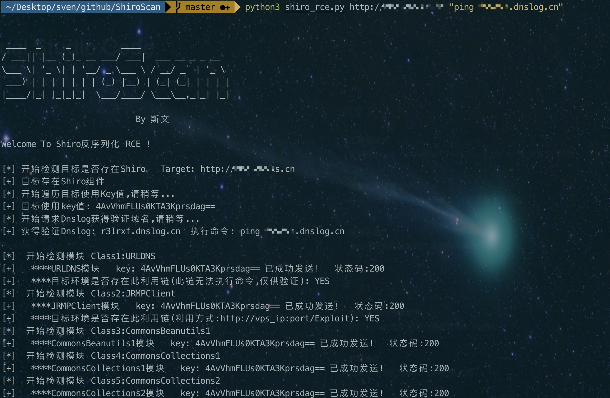

# ShiroScan
Shiro&lt;=1.2.4反序列化，一键检测工具

    2021·1·15:
    改动内容：1.删除CC8利用链
    改动内容：2.新增xray总结的k1到k4这4个利用链
    改动内容：3.新增Jdk8u20的利用链
    改动内容：4.新增GCM加密发包
    
    过往:
    改动内容：1.新增17个利用链模块,共28个利用链，预计增加成功率30%，已打包成新ysoserial的jar包，请勿更换
    改动内容：2.可直接获得目标使用key值
    改动内容：3.新增30个key(再多意义也不大)
    改动内容：4.输入命令自动进行bash编码，防止未了解此漏洞的人踩坑

```
共集成51个key进行fuzz
```

* 如果有帮助，请点个star哦， blog：https://www.svenbeast.com
* pip3 install -r requirments.txt   
* 若import模块错误，安装不成功，请到linux系统安装运行，或者去python库将crypto首字母改为大写并尝试pip install pycryptodome")
* 如果存在异常java信息，请使用jdk1.8环境运行，避免使用高版本java运行

* Usage：python3 shiro.py  url  command
* Usage：python3 shiro.py  http://url.com  whoami

* http://www.dnslog.cn/   验证推荐使用这个dnslog平台，速度比ceye.io要快很多
* 执行的命令带空格记得用""引起来

* usage：python3 shiro.py  http://url.com  "ping dnslog.cn"
* 28个模块全部跑一遍,然后去dnslog平台查看是否收到请求，不出来就GG，也可能是因为目标使用的编码很冷门，可使用其他工具

* 请自行收集编码，在moule下的key.log中自行添加即可(格式: key:任意值)

## 本着尽可能的检测目标是否存在漏洞为目的所开发，并未对利用链进行大量删减
## 不推荐当做exp使用，效率问题
## 内置的yso的jar包存在tomcat回显链，并未集成到工具中，初衷是漏洞检测工具，有条件的可自行生成payload，header加入cmd:whoami即可
## 仅供安全人员验证,测试是否存在此漏洞
